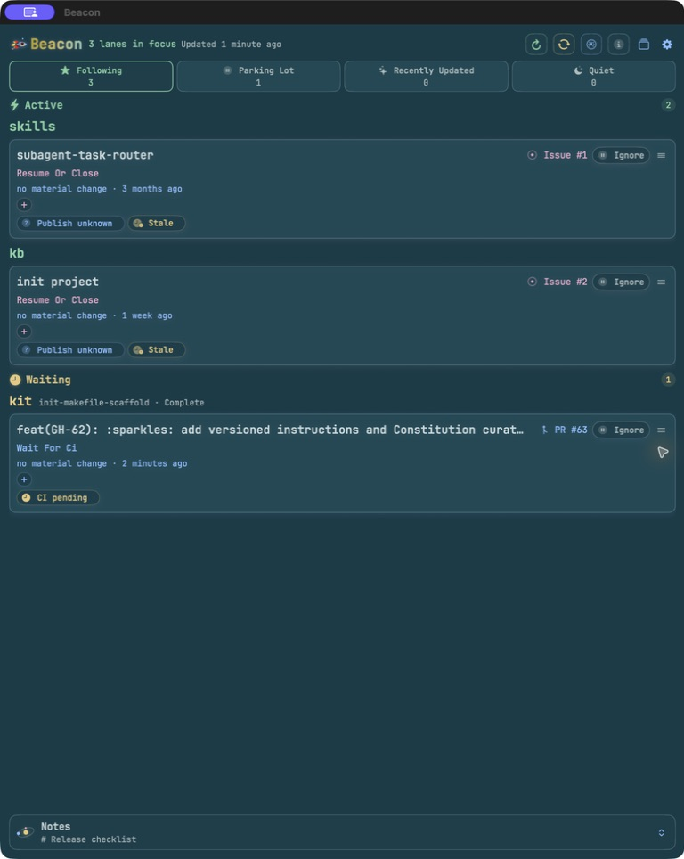
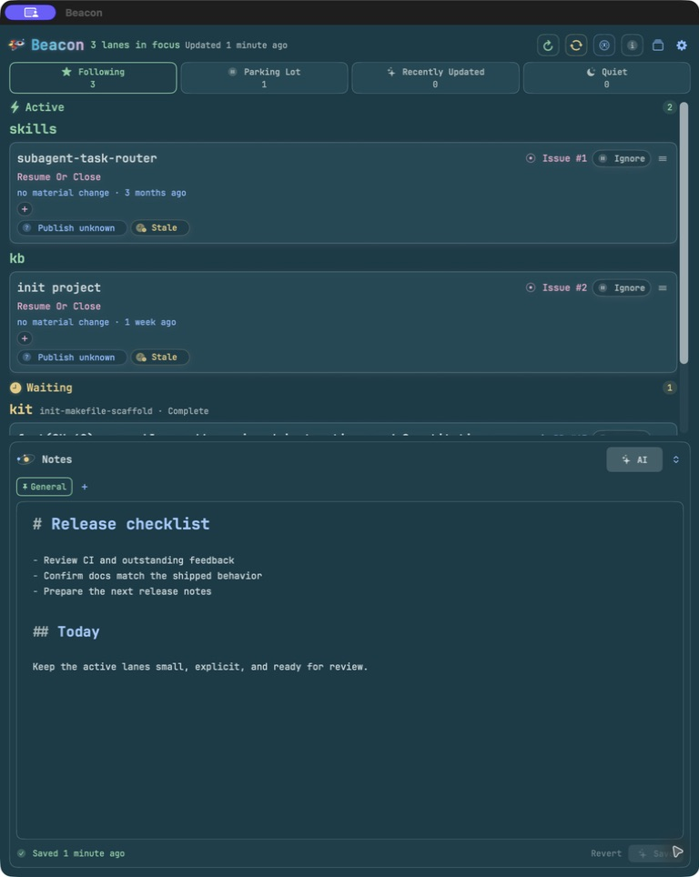

```text
██████╗ ███████╗ █████╗  ██████╗ ██████╗ ███╗   ██╗    \  |  /
██╔══██╗██╔════╝██╔══██╗██╔════╝██╔═══██╗████╗  ██║     .---.
██████╔╝█████╗  ███████║██║     ██║   ██║██╔██╗ ██║     |[_]|
██╔══██╗██╔══╝  ██╔══██║██║     ██║   ██║██║╚██╗██║     |   |
██████╔╝███████╗██║  ██║╚██████╗╚██████╔╝██║ ╚████║     |   |
╚═════╝ ╚══════╝╚═╝  ╚═╝ ╚═════╝ ╚═════╝ ╚═╝  ╚═══╝    /_____\

                        working-set memory for coding agents
```

Beacon keeps a small, durable memory of the three to eight work lanes that need
your attention. It combines near-real-time local Git evidence, conservatively
cached GitHub evidence, factual changes since you last looked, and optional
short notes and tags to answer: what am I working on, what changed, and what
should I do next?

<!-- BEGIN KIT-MANAGED README BADGES -->
[](https://github.com/jamesonstone/beacon/commits) [](https://github.com/jamesonstone/beacon/issues) [](https://github.com/jamesonstone/beacon/pulls) [](https://github.com/jamesonstone/beacon/actions/workflows/ci.yml) [](https://github.com/jamesonstone/beacon/releases)
<!-- END KIT-MANAGED README BADGES -->

The Go CLI and its user-scoped background agent are the source of truth. The
native macOS application provides both a menu-bar extra and a detachable Dock
window; both consume the same cached schema-v3 snapshots and incremental agent
events through a bundled copy of the executable.

## macOS App

### Following dashboard



### Signal Notes



## Requirements

- `git`
- [GitHub CLI](https://cli.github.com/) authenticated with `gh auth login`
- macOS 14 or later for the macOS app
- Go 1.26 and Xcode only when building from source

## Install From A Release

Each [GitHub release](https://github.com/jamesonstone/beacon/releases) contains:

- `beacon_<version>_darwin_arm64.tar.gz` for Apple Silicon Macs
- `beacon_<version>_darwin_amd64.tar.gz` for Intel Macs
- `beacon_<version>_linux_arm64.tar.gz` and `beacon_<version>_linux_amd64.tar.gz`
- `Beacon_<version>_macos_universal.zip` for the universal macOS application
- `checksums.txt` for SHA-256 verification

Download the archive for your platform from the latest release. For example,
to install the Apple Silicon CLI into `~/.local/bin`:

```bash
VERSION=0.1.0
ASSET="beacon_${VERSION}_darwin_arm64.tar.gz"
curl -LO "https://github.com/jamesonstone/beacon/releases/download/v${VERSION}/${ASSET}"
curl -LO "https://github.com/jamesonstone/beacon/releases/download/v${VERSION}/checksums.txt"
grep " ${ASSET}$" checksums.txt | shasum -a 256 -c -
tar -xzf "${ASSET}"
mkdir -p ~/.local/bin
install -m 0755 "beacon_${VERSION}_darwin_arm64/beacon" ~/.local/bin/beacon
beacon version
```

Use the `amd64` archive on an Intel Mac or x86-64 Linux machine. Ensure
`~/.local/bin` is on your `PATH`.

For the macOS application, download the universal zip, verify it against
`checksums.txt`, expand it, and move `Beacon.app` into `/Applications`.

```bash
VERSION=0.1.0
ASSET="Beacon_${VERSION}_macos_universal.zip"
curl -LO "https://github.com/jamesonstone/beacon/releases/download/v${VERSION}/${ASSET}"
curl -LO "https://github.com/jamesonstone/beacon/releases/download/v${VERSION}/checksums.txt"
grep " ${ASSET}$" checksums.txt | shasum -a 256 -c -
ditto -x -k "${ASSET}" .
mv Beacon.app /Applications/
open /Applications/Beacon.app
```

Release applications are ad-hoc signed for bundle integrity but are not
Developer ID signed or notarized. If Gatekeeper blocks a checksum-verified
download from this repository, remove its quarantine attribute once, then open
it again:

```bash
xattr -dr com.apple.quarantine /Applications/Beacon.app
open /Applications/Beacon.app
```

Do not remove quarantine from an app you did not obtain from a verified Beacon
release.

## Quick Start

Authenticate GitHub, initialize Beacon with one or more repository roots, then
run the dashboard:

```bash
gh auth login
beacon init --source ~/go/src/github.com --yes
beacon agent install
beacon
```

Run `beacon init` without flags for an interactive directory and repository
selector. The macOS application uses the same configuration and displays the
same scan snapshot as the CLI.

## Structured Task Activity (macOS)

Beacon can add an optional transient activity chip to the exact followed
project or worktree lane using documented local lifecycle hooks. This context
is separate from schema-v3 evidence: it never changes Following, lane
attention, readiness, next action, ordering, refresh priority, or the menu-bar
lane count.

### Support matrix

| Source | Version 1 support | Notes |
| --- | --- | --- |
| Codex local lifecycle hooks | Supported | `UserPromptSubmit`, `PermissionRequest`, and `Stop`; a local Codex surface must actually execute the installed hooks. |
| Claude Code | Supported | Structured prompt, permission, selected attention notifications, Stop, StopFailure, and SessionEnd hooks. |
| ChatGPT | Unsupported | No notification or chat-text approximation. |
| Ordinary Claude chat / Cowork | Unsupported | Claude Code hooks only. |
| Warp | Unsupported | Terminal notification text is not parsed. |
| Generic VS Code activity | Unsupported | A supported provider may run in its terminal, but Beacon has no VS Code extension or editor activity source. |
| macOS Notification Center or Accessibility | Unsupported | Beacon requests no new macOS permission and uses no private system integration. |
| Unstructured notifications or remote sessions without local hooks | Unsupported | Beacon does not guess from titles, prompts, transcripts, or free text. |

Install, inspect, or remove one supported integration explicitly:

```bash
beacon integrations install codex
beacon integrations status codex
beacon integrations uninstall codex

beacon integrations install claude-code
beacon integrations status claude-code
beacon integrations uninstall claude-code
```

Install and uninstall preview every exact handler change and adjacent backup
path, then require confirmation. Use `--yes` only when that preview is already
an explicit non-interactive choice. Beacon refuses malformed settings,
preserves unrelated hooks, writes `0600` backups and replacements, and marks
its own handlers with `beacon-activity-v1` so uninstall removes only those
handlers. Each installed shell command redirects output and ends with
`|| true`, so a moved or missing Beacon executable cannot delay or break the
provider hook.

The chip states have deliberately narrow meanings:

- **Working**: Beacon most recently observed `UserPromptSubmit`.
- **Needs attention**: Beacon most recently observed a permission request or a
  documented Claude Code attention notification. Providers do not always emit
  a resolution event, so the cue remains until another prompt, Stop,
  SessionEnd, or expiry.
- **Turn finished**: Beacon observed `Stop`; only the latest turn stopped. This
  does not mean that the task or project completed.

Working expires after two hours, latest-attention after 24 hours, and
turn-finished after one hour. Go physically removes expired records from
`activity.json`; the macOS app schedules the next Go prune and never treats
Swift filtering as expiry. No activity history is retained. `StopFailure`
clears current Claude Code activity without inventing a failure badge, and
`SessionEnd` removes that session immediately.

Integration health distinguishes configuration from observed execution:

- `not_installed`: no exact Beacon handler is present.
- `installed`: the handler and executable match, but Beacon has not observed a
  callback for that exact fingerprint.
- `active`: Beacon observed a well-formed callback for the current fingerprint.
- `stale`: the command, marker, handler set, or executable no longer matches.
- `error`: provider settings or health state cannot be inspected safely.

Codex may still require hook trust, and Claude Code hooks may be blocked by
managed policy. `active` confirms one observed callback since the current
handler was installed; it cannot prove that provider policy was not changed
later. Hook callbacks never start the Beacon agent. If the agent is unavailable,
Beacon records only that the callback ran and drops the activity event.

## Build From Source

```bash
make build
make test
```

The standalone executable is written to `bin/beacon`. Install it on your `PATH` with:

```bash
make install
```

Build, test, or launch the macOS app with:

```bash
make macos-build
make macos-test
make macos-run
```

`make macos-run` rebuilds Beacon, gracefully stops any currently running app
instance, and then launches the new Debug bundle without creating a duplicate
menubar item.

Release packaging is validated with:

```bash
make release-test
```

Local `make build` binaries report embedded VCS information as a revision-based
development version, including a `dirty` marker when applicable. Published
artifacts report the exact release SemVer and release commit instead.

## Configuration

Beacon resolves configuration in this order:

1. `--config <path>`
2. `BEACON_CONFIG`
3. `$HOME/.config/beacon/config.yaml`

Let Beacon create or extend the default file. A repository path becomes an
explicit repository; a parent directory is persisted as a source and
rediscovered on every scan.

```bash
beacon init --source ~/go/src/github.com/jamesonstone/beacon --yes
beacon init --source ~/go/src/github.com --source ~/Projects --yes
# Or use the interactive directory/repository selector:
beacon init

beacon config validate
```

`beacon config init` remains an alias for `beacon init`. Initialization checks
for `git`, `gh`, and GitHub authentication, previews non-destructive changes,
and atomically writes the configuration only after confirmation. It never
installs packages or removes existing sources or repositories; interactive
setup may separately offer to enable Beacon's current-user background agent.

Example:

```yaml
version: 2

settings:
  scan_interval: 1m
  remote_refresh_interval: 45m
  stale_after: 24h
  max_parallel: 4
  github_author: '@me'
  github_scope: mine
  ollama_model: gpt-oss:20b
  tracked_refresh_interval: 1m
  untracked_probe_interval: 10m

sources:
  - path: ~/go/src/github.com/jamesonstone
  - path: ~/go/src/github.com/lsmc-bio
  - path: ~/go/src/github.com/limina-dev
  - path: ~/go/src/github.com/spectral7-ltd
  - path: ~/go/src/github.com/appliedsymbolics

repositories:
  - name: beacon
    path: ~/go/src/github.com/jamesonstone/beacon
    github: jamesonstone/beacon
    base: main
    remote: origin
```

Source entries are directory roots, not shell globs. A source such as
`~/go/src/github.com/jamesonstone` discovers every GitHub repository beneath
that directory on every scan; do not store a trailing `/*` in the YAML.

Use `repositories` only when you want to watch one repository explicitly or
override its discovered name, GitHub slug, base branch, or remote. Beacon
deduplicates overlapping sources and explicit repositories.

`github_scope: mine` includes PRs authored by `github_author` and issues
assigned to that identity. Use `all` to include every open PR and issue in each
discovered project. Explicit repository metadata overrides a discovery for the
same local or GitHub repository.

Configuration is strict: unknown fields, duplicate names or sources, invalid
durations or scope, missing paths, and malformed GitHub names are rejected.
Existing version-1 files remain readable and are migrated only by a confirmed
init operation or an explicit Ollama-default selection.

`ollama_model` is the optional default for the Notes assistant. It must name a
model installed in the local Ollama service to be selected automatically. If it
is absent, empty, or currently unavailable, Beacon uses the first installed
local model in stable name order without rewriting the configured value. Choose
**Settings → Ollama Model** to update the same field atomically. Beacon fixes
this integration to `http://127.0.0.1:11434` and excludes Ollama `:cloud`
entries.

Project-following choices are stored separately in the strict, versioned
`$HOME/.local/state/beacon/tracking.json`. Configuration defines what Beacon can
discover; this managed state defines which discovered repositories you
deliberately follow. New discoveries begin in Quiet. Existing version-1 JSON
and sibling `tracking.yaml` choices migrate automatically without changing the
current followed set; migrated YAML is archived with a `.migrated` suffix.

`tracked_refresh_interval` defaults to one minute and controls complete
local observations. These frequent observations do not fetch or contact
GitHub. `untracked_probe_interval` defaults to ten minutes and
controls inexpensive local/GitHub summary probes for projects outside
Following. If you manage a large quiet inventory, increase it to `1h` to reduce
background GitHub traffic while retaining activity awareness. New evidence
never changes Following membership. The agent
checks cached due times before discovery, so a scheduler tick with no due
project performs no source walk, `git fetch`, or `gh` command.

Beacon shares a persistent user-only cache across pull requests, issues, review
feedback, and muted probes. Most GitHub evidence is
reused for `remote_refresh_interval`; stable repository metadata is reused for
seven days. Cached activity can provide bounded stale fallback for 24 hours,
and repository metadata for 30 days, when GitHub capacity is protected. Set
`remote_refresh_interval: 45m` for a conservative daily-driver profile.

Before a cache miss Beacon reads `gh api rate_limit` and preserves 2,500
GraphQL points, 15 Search requests, and 1,500 REST Core requests for your own
interactive `gh` use. GitHub cache misses are serialized per rate bucket,
GraphQL work is conservatively budgeted at 25 points per command, and the
authoritative allowance is refreshed after at most five calls. When a bucket
reaches its reserve, Beacon serves its last successful cached result when
available and pauses new calls until the reported reset. Source discovery uses
only local Git remote and branch metadata and never calls GitHub. Beacon
never changes your `gh` credentials or stores a token. Cached evidence is
stored with user-only permissions under `$HOME/.cache/beacon/github/`.

With the default `github_scope: mine`, every due-project batch uses one global
authored-PR search and one global assigned-issue search, independent of the
number of configured repositories. Beacon enriches every open authored PR in a
followed project during background collection, regardless of age, while the
six-hour activity cutoff still limits outside-project enrichment. Explicit
scans and lane refreshes can inspect older outside work. Muted projects share
that same batched evidence instead of polling each repository.
`github_scope: all` is intentionally more expensive because it must enumerate
repository-scoped work.

## Everyday Use

```bash
beacon
beacon --include-idle
beacon --color=always
beacon doctor
beacon lanes
beacon lanes --parked
beacon pin 'gh:jamesonstone/beacon#5'
beacon park 'git:jamesonstone/beacon@GH-5'
beacon resume 'git:jamesonstone/beacon@GH-5'
beacon note 'git:jamesonstone/beacon@GH-5' 'finish the macOS smoke test'
beacon notes
beacon notes append 'Retest the merged release before lunch.'
printf '# Signal Log\n\n- verify PR #10\n' | beacon notes set
beacon notes new '[labcore] generate endpoints refactor'
beacon notes new --from-line 1
beacon notes list
beacon notes show --note 20260714T150000.000000000Z-a1b2c3d4
beacon notes open '[labcore] generate endpoints refactor'
beacon notes pin '[labcore] generate endpoints refactor'
beacon notes reorder-pinned 20260714T150000.000000000Z-a1b2c3d4 20260714T151500.000000000Z-e5f6a7b8
beacon notes unpin 20260714T150000.000000000Z-a1b2c3d4
beacon notes close 20260714T150000.000000000Z-a1b2c3d4
beacon notes delete 20260714T150000.000000000Z-a1b2c3d4
beacon notes edit
beacon notes path
beacon tag 'git:jamesonstone/beacon@GH-5' 'manual test'
beacon untag 'git:jamesonstone/beacon@GH-5' 'manual test'
beacon seen 'git:jamesonstone/beacon@GH-5'
beacon add --manual 'Research a smaller cache format'
beacon scan
beacon scan --include-idle
beacon scan --json
beacon scan --color=never
beacon scan --repo beacon
beacon sync
beacon sync check --no-fetch
beacon sync check --json
beacon sync apply owner/repository --yes
beacon limits
beacon limits --json
beacon ollama models
beacon ollama models --json
printf '{"context":"release checklist","messages":[{"role":"user","content":"find missing steps"}]}' | \
  beacon ollama chat --model gpt-oss:20b --json
beacon ollama set-default gpt-oss:20b
beacon projects
beacon select
beacon projects --followed
beacon projects --recent
beacon projects --quiet
beacon follow owner/important-project
beacon unfollow owner/old-project
beacon unfollow owner/one owner/two owner/three
# Compatibility aliases for existing scripts:
beacon track owner/important-project
beacon untrack owner/old-project
beacon refresh
beacon refresh beacon
beacon agent start
beacon agent status
beacon open 'gh:jamesonstone/beacon#2'
beacon open-next
beacon config path
beacon config open
beacon version
```

Bare `beacon` is a manual refresh every time: it asks the background agent to
check current Git and GitHub evidence, waits for the coalesced scan to finish,
and renders the updated working set. If the agent is unavailable, Beacon runs
the same blocking foreground scan instead. Opening or reconnecting the macOS
app remains cache-only; scheduled background collection retains its
conservative cadence. Use `beacon refresh [project]` when you want to queue
background work without waiting, or `beacon scan` for the complete diagnostic
inventory.

`beacon scan` remains the explicit, blocking diagnostic path and returns the
complete repository inventory. Human output names the highest-priority Ready or
Needs Action lane as `Next:` before the full table, while `scan --json` remains
deterministic, ANSI-free, and does not require the agent.
`--color=auto|always|never` controls human styling; auto requires a TTY and
honors `NO_COLOR`.

`beacon sync` is the explicit Git-only path for finding configured repositories
whose checked-out branch or local default branch is behind its fetched remote
default branch. In a terminal it fetches only the configured default-branch ref,
preselects every safe candidate, and asks once before updating one or many
repositories. Use `beacon sync check --no-fetch` for a network-free view of
existing local refs, or `beacon sync check` to run bounded
`git fetch --prune --no-tags` checks. `sync apply` requires named repositories
and `--yes` outside an interactive terminal.

Automatic sync is intentionally narrow: Beacon can fast-forward a clean
checked-out default branch, or return a clean fully merged feature branch to
the default branch and fast-forward it. Dirty, detached, diverged, missing-ref,
unmerged, and multi-worktree cases remain manual. This workflow never invokes
`gh` or the GitHub API and never rebases, resets, stashes, deletes, commits,
pushes, or changes GitHub state.

For followed projects, Beacon also remembers open pull requests it has already
observed. If a later scheduled evidence refresh finds that such a PR disappeared
while its local feature branch remains checked out, Git first verifies that the
remote head is gone. Beacon then uses one exact, cached `gh pr view` request to
confirm the PR merged, with a hard limit of three confirmations per refresh.
Confirmed cases show a read-only warning in both macOS surfaces; the warning
opens Repository Sync but never checks out, pulls, or deletes anything.

`beacon limits` is an explicit snapshot of the external rate-limited dependency
Beacon currently uses: authenticated `gh`. One invocation runs one bounded
`gh api rate_limit` request and shows GraphQL, REST Core, and Search usage,
remaining allowance, and reset time. Beacon never runs this command at startup
or on a schedule; JSON output is available for the bundled macOS helper.

The default working-set view groups lanes as **Active**, **Waiting**,
**Recently Active**, and **Parked**. Dirty or unpublished work, recent local
commits, open in-scope PRs and issues in followed projects, pinned lanes, and
manual lanes can enter the working set. Open PRs and issues remain Active
regardless of age until they close or are explicitly parked. `beacon lanes
--parked` reveals parked lanes without allowing other historical inventory to
consume the primary view.

Lane notes and tags are optional memory cues, never status truth. Beacon stores them
with attention and last-seen observations in the user-only strict JSON file
`$HOME/.local/state/beacon/lanes.json`. When Git or GitHub evidence changes
after a note, both clients label that note as stale and show a factual delta
such as `new commit observed`, `PR #5 opened`, or `CI changed from pending to
success`. Tags are short, deduplicated labels that can be added or removed from
the CLI and macOS lane cards; they never affect Beacon's attention or action
policy. Manual lanes support planning or research without requiring Git,
GitHub, Kit, or a Codex task API.

That same Go-owned file stores one complete user lane order. Drag the handle on
any macOS card to reorder within Active, Waiting, Recently Active, or Parking
Lot; the relative priority survives evidence moving the lane to another group
and is shared by the menu, detached dashboard, agent, and CLI. Drop a card on
**Parking Lot** to Ignore it or on **Following** to Resume it. Card click still
opens the work item. Keyboard users can choose **Move Up** or **Move Down** from
the card menu. `beacon reorder <lane-id>...` exposes the atomic complete-order
mutation for scripts; use the IDs and current order from `scan --json`.

`beacon notes` is a local tabbed Markdown workspace for real-time thoughts that
span lanes. The original `$XDG_DATA_HOME/beacon/notes.md` document remains the
pinned General tab and the target of every command without `--note`. Detail
notes use stable IDs under `$XDG_DATA_HOME/beacon/notes/<id>.md`; their trimmed
first line is the displayed title, while `notes/workspace.json` preserves open
order, active selection, and most-recently-opened history. Closing a tab never
deletes its file; `delete` is the separate permanent detail-note operation and
never accepts General or New Tab.

Use `list`, `new`, `open`, `close`, and `delete` to manage the workspace.
`show`, `set`, `append`, `edit`, and `path` accept
`--note <stable-id-or-unique-exact-title>`; `general` explicitly selects the
original document. `new --from-line N` copies one General line as a new detail
title without changing General. Duplicate titles are allowed but require a
stable ID when selecting or deleting them. Every document keeps the 256 KiB
bound, and all files and workspace state are atomically saved with user-only
permissions. On macOS, `beacon notes edit` waits for the editor to close and
publishes the saved workspace to running Beacon clients.

Idle work inside Following is treated as inventory instead of queue content.
Human output hides idle followed projects by default and replaces them with a
compact count; pass `--include-idle` to list that inventory. `beacon scan
--repo NAME` always shows the selected project even when it is idle. An idle base lane is omitted
when its project already has active work. JSON remains complete regardless of
these presentation filters.

Following is an explicit repository-level choice, independent of lane attention.
Every open PR and issue allowed by `github_scope` for a followed project remains
visible in Following regardless of its last update time; Park is the explicit
way to hide that lane without unfollowing its project.
Use `beacon select` (or the compatible bare `beacon projects`) for a colorful,
searchable multi-select of every discovered project. Followed projects start
highlighted; use the arrow keys to scroll, Space to toggle a project, `/` to
filter, and Enter to confirm. `beacon follow` and `beacon unfollow` accept a
stable `owner/repository` identity or a unique discovered name. The established
`track` and `untrack` commands remain compatibility aliases. Multiple arguments
are applied as one atomic agent mutation without a GitHub scan.

Projects outside Following retain an evidence baseline. Later local or GitHub
changes move them to **Recently Updated** for `settings.stale_after`—24 hours by
default—without silently following them. You can inspect the factual reason and
decide whether to Follow. When the window expires, they return to **Quiet**.
Incomplete evidence is never compared as if it were a material change.
Repository-scoped diagnostics remain in JSON without flooding the focused lane
dashboard.

Follow and Stop Following actions are optimistic and nonblocking. Each
selection moves the project immediately and joins a visible background queue.
The Go agent
acknowledges from cached evidence without a network probe; incomplete evidence
creates a pending baseline that a later complete scan initializes. The next
scheduled muted probe establishes the compact comparison baseline. Beacon
processes the queue in selection order, keeps navigation and scanning
available, and rolls back only the affected project if a request fails.

## macOS Dashboard

Beacon remains in the menu bar and also runs as a regular macOS application,
so its illustrated beacon icon is available in the Dock and Command-Tab when a camera
notch or a crowded menu bar hides the menu item. Beacon restores the dashboard's
last position and size across application relaunches. With no saved frame, it
opens at a focused 580-point width and the full usable screen height. Close the
window to keep Beacon running quietly;
choose **Open Dashboard** in the top-right Settings menu or activate Beacon from the Dock or
Command-Tab to reopen the same window.

The menu and detached window are two views over one shared background-agent
connection. They show the same Following, Parking Lot, Recently Updated, and
Quiet views and never
start duplicate repository scans. Secondary actions live in the top-right gear
menu so lane evidence receives the full height. The adjacent view button
switches between the default stacked list, horizontal state tiles, and an
experimental kanban board, plus **Overview (Experimental)** and **Fit
Following**. Overview uses an adaptive dense grid, omits empty groups, and
temporarily minimizes Notes; the prior Notes size returns when leaving
Overview. Fit Following keeps Notes in the lower half and scales every current
Following lane into the upper half without a separate lane-area scroll. The
selection persists across launches, and smaller windows remain usable. Each
fitted card uses its full background for an oversized, clipped project-name
watermark, so repository identity remains visible without consuming any grid
space. A slow theme-specific color highlight travels through the letters while
the lane's factual content and controls remain in front.
In the default stacked view, each project name is a solid, bold heading above
its lanes so repository context is visible before the pull request or issue
title.

### Drop-down Terminal

With Beacon active, press **Command-J** to show its native terminal inside the
current Beacon dashboard window frame. The terminal tracks the dashboard's
saved position and size and remains clipped to its visible screen. Press
**Command-J** again to hide it. Beacon handles this shortcut only while Beacon
or its terminal panel is active, so other applications keep their own
**Command-J** behavior.
The terminal retains one login-shell session while Beacon is running, starts in
the user's home directory, and uses the configured `SHELL` when it is an
executable absolute path (otherwise `/bin/zsh`). Terminal output is not
persisted by Beacon. The selected Beacon theme also supplies the terminal's
default text, cursor, selection, and complete 16-color ANSI palette. Default
command input and ANSI-16 prompt colors remain readable against the terminal
canvas, and changing the theme updates an open terminal immediately.

Choose **Settings → Terminal** to open the panel without the shortcut, place it
at the top or bottom of the Beacon window bounds, and select Compact (30%),
Balanced (45%, the default), or Spacious (60%) height. Moving or resizing the
dashboard updates a visible terminal immediately. The application-local
shortcut requires no Accessibility or Input Monitoring permission and does not
reserve **Command-J** system-wide.

Warp cannot be embedded or controlled through a supported public API. When
Warp is installed, **Settings → Terminal** can open it and its official
[`Global Hotkey` guide](https://docs.warp.dev/terminal/windows/global-hotkey)
as an external alternative. Warp can keep its own shortcut because Beacon does
not receive **Command-J** while Warp is active. Beacon's structured task
activity support matrix still lists Warp as unsupported because terminal text
is never parsed as work-lane evidence.

Choose **Settings → Appearance → Theme** to apply one live appearance to both
surfaces and the native Markdown editor. Beacon includes exactly five themes:
**Lobster Nebula** (the recommended default dark theme), **Pampas Moon** (the
high-readability light theme), **Solarized Dark**, **Monokai**, and **Selenized
Dark**. The stable selection persists across launches. Every theme supplies the
same semantic canvas, surface, border, text, focus, status, Local/PR/Issue, and
editor and terminal roles, so changing appearance never changes workflow
meaning.

A dedicated refresh button in the top-right of both surfaces performs
**Scan Now**. Use it after merging one or several pull requests to bypass the
normal evidence cache, run one coalesced batched refresh, and update both views.
Repeated clicks cannot start overlapping scans.

The adjacent **Repository Sync** button first shows a network-free comparison
against existing remote-tracking refs. Its badge counts repositories that need
attention. **Check for Updates** explicitly fetches only each configured remote
default branch; row, selected, and all-safe buttons then run the same guarded
fast-forward behavior as `beacon sync`. Both macOS surfaces delegate this work
to Go and never execute Git or `gh` directly.

The next **Dependency Limits** button is also explicit-only. Selecting it asks
the bundled Go helper for one `gh api rate_limit` snapshot and shows the
GraphQL, REST Core, and Search buckets. After the first check, the button shows
the highest usage percentage as explicitly labeled healthy below 50%, warning
from 50% through 75%, and critical above 75%; zero usage retains the gauge
icon. Each state has an SF Symbol and semantic theme color. No startup request
or background polling is added.

A compact tab row keeps repository attention one click away. **Following** is
selected whenever a dashboard surface opens and contains Active, Waiting, and
Recently Active lanes. **Parking Lot** is the next peer tab, followed by
**Recently Updated**, the outside-activity inbox, and **Quiet**, the remaining
discovered inventory. Both outside views are searchable and provide a
nonblocking Follow action. Settings keeps only the Following manager instead of
duplicating those primary tabs. Any destination control opens its page on the
first selection and returns to **Following** when selected again; selecting a
different destination switches directly to it. This applies to the peer tabs,
Repository Sync, Dependency Limits, and Manage Following.

When Following has no work in progress and no projects are still loading, the
blank lane area becomes a lightweight **All caught up** backsplash. Its native
SwiftUI orbit adapts to the compact menu extra and the detached window, respects
Reduce Motion, and describes lane state without claiming local Git refs are current.

The Beacon wordmark carries a modest theme-derived color wave. It uses a shared,
deterministic time phase in the menu and detached window and becomes static
when Reduce Motion is enabled.

Lane cards identify the kind of work consistently in every view with explicit
**Local**, **PR**, **Issue**, or **Manual** text and a stable SF Symbol. Each
theme reinforces Local, PR, and Issue with distinct semantic accents, but color
never carries identity or status alone. Attention groups retain their own
label-and-symbol grammar; card identity does not change shared Go policy.
Every Following card also places **Ignore** at its far-right edge. Ignore uses
the same durable parking action as the CLI, so the selected lane leaves
Following and appears in **Parking Lot** without unfollowing its project or
deleting any lane state.
When Beacon confirms that a previously observed PR merged, its remote head was
deleted, and the same branch remains checked out locally, the card also shows an
explicit warning triangle beside its right-aligned actions. Dirty worktrees or
commits newer than the recorded PR head use explicit warning or danger roles.
Selecting the warning opens
Repository Sync; it performs no repository mutation itself, and Ignore remains
the far-right Following action.

The menu-bar item is one colored beacon dome with the live in-progress lane
count set directly inside it. Its width and numeral scale adapt through `99+`,
so the app identity and current workload remain recognizable as one compact
status item.

Beacon defaults to **JetBrainsMono Nerd Font** and keeps essential interface
copy at least 11 points. Choose **Settings → Appearance → Font** to select any
font family installed on the system; the menu extra, detached dashboard,
read-only Markdown, and native Signal Notes editor update live and share the
persisted choice. If a selected family is later removed, Beacon falls back to
JetBrainsMono Nerd Font when available and otherwise uses safe system fonts.
Settings also provides 11, 12, 13, 14, and 16-point base sizes. A separate
persisted **Card Density** setting offers Comfortable, Compact, and Dense
without changing font size. Comfortable retains the full card, Compact keeps
identity, next action, age/delta, and exceptions, and Dense keeps identity, next
action, and one exception summary. Lane notation remains optional local
context: use the trailing **+** to add a tag and the chip's close control to
remove it.

Canonical evidence badges now show exceptions only. Healthy defaults such as
clean worktrees, successful CI, approved review, and current freshness stay
quiet. Explicit labels and SF Symbols identify conditions such as **Local
changes**, **CI pending**, **CI failed**, **Stale**, and **PR feedback · 2**;
color never carries status alone. The last label means two unresolved pull
request review threads. Hover it for every collected file/line, reviewer,
Markdown comment, timestamp, and individual GitHub link. A badge's trailing
close control still provides exact-value local dismissal, so changed evidence
reappears; **Restore Hidden Badges** clears all dismissals.

Beacon follows macOS **Increase Contrast**, **Differentiate Without Color**,
**Reduce Transparency**, and **Reduce Motion**. These preferences strengthen
borders, retain redundant labels and symbols, replace translucent overlays with
solid theme surfaces, and stop decorative or layout motion without changing
saved workflow state. The fitted project watermark becomes fully opaque with
Increase Contrast, desaturates with Differentiate Without Color, and holds a
centered static highlight with Reduce Motion. Automated checks require at least
4.5:1 contrast for normal text and 3:1 for focus, strong borders, and large
indicators in every built-in theme.

The information button beside View and Settings explains the universal
hierarchy: work-item identity, lane attention, one next action, evidence
exceptions, then optional local context. Hover or keyboard-focus any card for a
traversable detail panel with its bounded issue or PR description, links,
reasons, warnings, blockers, and local context. The panel is rendered entirely
from cached scan evidence, can be pinned, and closes with Escape; hovering never
runs Git or GitHub work. GitHub descriptions and review comments use one shared,
theme-aware Markdown document renderer: headings, paragraphs, ordered and
unordered task lists, quotes, code, dividers, tables, emphasis, and links retain
their structure instead of being collapsed into continuous text. The same
renderer is used wherever Beacon presents read-only Markdown; ordinary status
labels remain explicit interface copy.

The playful **Notes** panel sits at the bottom of both surfaces. It opens at 50%
of the available Beacon surface height; double-clicking its header cycles 50%,
80%, minimized, then 50%, while its chevron minimizes or restores the most
recent expanded size. The header's solar system, the empty-state orbit, and the
slow rocket beside the Beacon wordmark stop moving when Reduce Motion is on.

Its horizontally scrolling tab strip keeps permanently pinned General first,
then user-pinned details in their persisted drag order, then unpinned open
details in stable order. A detail's pin control adds or removes it from the
pinned group; pinned details stay open until unpinned. Distinct close and delete
controls remain available on hover or keyboard focus. New Tab is one persistent
picker over all prior detail files in most-recently-opened order, with each
permanent delete control aligned at the row's far right; reopening an already-open
note activates it without duplication. Detail-note results in Command-K and
Command-P also expose delete, and every macOS delete action requires the same
irreversible-action confirmation. The switcher uses an opaque semantic theme surface so
commands remain readable over the dashboard. The directly editable native
editor applies headings, emphasis, lists, quotes, inline code, links, and
dividers while retaining exact plain-text source. It also uses the user's macOS
dictionaries for spelling underlines while leaving grammar checking and
automatic spelling correction disabled.

Both surfaces share one draft and three-second autosave queue. A switch or close
flushes dirty content first and stays on the current tab if saving fails. Use
**Create New Note from Highlighted Text in General** while editing General to
copy the caret line into a new note. Command-K opens the app-wide quick switcher,
Command-P searches notes only, Control-Tab or Command-Shift-bracket cycles tabs,
and Command-1 through Command-9 selects by open-tab position. All writes and
deletions travel through the Go agent authority so the menu, detached window,
and CLI remain synchronized.

Press the compact animated assistant button with its brain-and-spark mark at any
time to open the local Ollama assistant directly below it. Command-I opens a
larger conversation panel from the right edge; Command-Shift-I opens the compact
panel. Beacon attaches the exact non-empty editor selection when one exists;
otherwise it snapshots the entire current note, including visible unsaved edits.
The complete attachment appears at the start of the scrollable conversation and
can be removed before sending, so a prompt may continue without Notes context.

Every user and assistant turn remains visible in order for the active session,
and each follow-up sends that complete role-aware conversation to Ollama. History
scrolls independently while the unsent prompt, local-model selector, and Send
action stay pinned at the bottom. Switching between compact and large panels
preserves the conversation; **Cancel** exits and resets it. **Ask AI About Current
Note** is also available in both Command-K Quick Switcher and Command-P Tab
Search. Context and conversation messages travel to the bundled helper over
stdin, never in process arguments. This narrow assistant keeps no persistent
chat history, runs no background insights, excludes cloud models, and never
edits the note automatically. The Settings default and `settings.ollama_model`
are the same configuration value.

Use **Open Beacon at Login** in either view to enable quiet startup. Beacon
registers its embedded login helper through macOS Service Management. A login
launch starts without opening the dashboard; selecting Beacon later opens it.
If macOS requires approval, choose **Approve in Settings** and enable Beacon in
System Settings > General > Login Items. This preference is off by default.

The rotating lighthouse trivia loader remains available during interactive
onboarding before the first background cache is ready.

Non-blocking discovery, prunable-worktree, search-truncation, and optional Kit
progress diagnostics contribute to the warning count in the dashboard header;
they do not appear as fatal errors. Full warning detail remains available in
`beacon scan --json`. The red `Errors` section is reserved for failures that
prevent Beacon from collecting expected evidence.

`scan --json` emits schema version 3 with projects, ordered lanes, issue and PR
descriptions, checks, bounded unresolved review-thread/comment detail, optional
Kit progress, lane attention and tags, scoped
warnings, and scoped errors. It
never emits ANSI or additional stdout logging, making it safe for the macOS app
and automation.

Common workflows:

- Run `beacon` for the colorful project dashboard.
- Run `beacon --include-idle` when auditing idle work inside Following.
- Run `beacon select` to curate Following interactively.
- Run `beacon projects --recent` to inspect outside activity.
- Run `beacon projects --quiet` to inspect the remaining discovered inventory.
- Run `beacon refresh [project]` to request background work without blocking.
- Run `beacon sync` after merged pull requests to select safe local updates.
- Run `beacon sync check --no-fetch` for a network-free stale-branch check.
- Run `beacon agent status` to inspect the process, socket, cache count, and active refresh.
- Run `beacon open-next` to open the highest-priority review or action item.
- Run `beacon reorder <lane-id>...` to atomically persist a complete lane order.
- Run `beacon scan --repo NAME` to focus on one configured project.
- Run `beacon scan --json` for scripts or diagnostics.
- Click a macOS-app lane to open its pull request, issue, or local worktree.
- Run `beacon init --source <new-root> --yes` to merge another persistent source
  into the existing configuration without removing current entries.

## Updating

Merges to `main` create one semantic version for both the CLI and macOS app.
Breaking Conventional Commits bump the major version, `feat` commits bump the
minor version, and all other accepted commits bump the patch version. GitHub
generates release notes from the merged changes.

To update, download and checksum the matching assets from the latest release,
replace the CLI binary and/or `/Applications/Beacon.app`, and confirm the CLI
version:

```bash
beacon version
```

Upgrading does not rewrite `$HOME/.config/beacon/config.yaml`.

## Background Agent

Beacon uses the same executable for interactive commands and background work:

```bash
beacon agent install
beacon agent start
beacon agent status
beacon agent stop
beacon agent uninstall
```

On macOS, installation creates the current-user LaunchAgent at
`~/Library/LaunchAgents/com.jamesonstone.beacon.agent.plist`. It runs only as
the current user, uses the authenticated `gh` CLI, and never stores GitHub
credentials. Authenticate `gh` persistently with `gh auth login`; environment-
only tokens are not copied into the LaunchAgent.

The macOS app starts or reconnects to this single user agent when it launches
and synchronously unloads the LaunchAgent when the application quits. Closing
only the detachable dashboard leaves the menu extra and agent active. Ordinary
direct CLI work also starts a stopped agent on macOS; `beacon agent start` is
the explicit idempotent form. `beacon agent stop` is safe to repeat and keeps
the plist, notes, following state, and caches so the next CLI or app launch can
resume them.

Operational files are user-only:

```text
~/.local/state/beacon/tracking.json
~/.local/share/beacon/notes.md
~/.cache/beacon/projects/*.json
~/.cache/beacon/activity.json
~/.cache/beacon/integration-health.json
~/.cache/beacon/agent.sock
~/.cache/beacon/agent.pid
~/Library/Logs/Beacon/agent.log
~/Library/Logs/Beacon/agent-error.log
```

One bounded worker pool scans followed projects independently. Projects outside
Following receive lightweight probes at the slower configured interval; Beacon
records material deltas as recent activity without changing membership.
Duplicate refreshes
coalesce, and a project never has overlapping jobs.

The activity cache keeps only current normalized provider/state, a hashed
opaque session key, exact project/lane target, and expiry/coalescing times. The
health file keeps only handler fingerprints and observed flags. Raw provider
payloads, prompts, transcripts, assistant text, tool inputs, notification
text, and unhashed session IDs are never written to either cache or Beacon
logs.

## Read-only boundary

Scanning may run a timeout-bounded `git fetch --prune --no-tags` to refresh
remote-tracking metadata. Beacon never edits working files, changes branches,
pushes commits, creates pull requests, changes reviews, or merges work. Beacon
writes only its own configuration during confirmed `beacon init` operations or
an explicit Ollama-default selection, plus its own user-scoped following state,
Markdown signal notes, cache, PID/socket,
LaunchAgent, and rotated logs. New evidence may update a non-followed project's activity timestamp but
never changes whether the user follows it.
Confirmed `beacon integrations install|uninstall` operations may also update
only Beacon-marked handlers in supported provider JSON settings after creating
an adjacent restrictive backup; hook execution itself remains observational.

## Architecture

- `cmd/beacon` and `internal/` implement config, source discovery,
  Git/GitHub/Kit evidence collection, lane correlation, managed tracking state,
  cache/protocol/scheduling, policy, output, structured hook normalization, and
  provider integration settings. `internal/ollama` alone owns the bounded
  loopback Ollama HTTP boundary and local-model validation.
- `macos/Beacon` contains the shared SwiftUI menu/dashboard app, embedded login
  item, app icon, and tests.
- The Xcode build embeds the Go executable as `Contents/MacOS/beacon-cli`; the standalone executable remains `beacon`.
- `.github/workflows/release.yml` validates, versions, packages, and publishes both products after a merge reaches `main`.
- Work lanes are active Git worktrees, scoped open pull requests, and scoped open issues. Unattached local branches are not scanned.

## Troubleshooting

Run `beacon doctor` first. It checks `git`, `gh`, authentication, configuration,
tracking-state migration, the background agent, local repositories, and GitHub
access. A repository-specific failure is reported without suppressing healthy
cached or freshly scanned projects.

If the agent is unavailable, inspect `beacon agent status` and the files under
`~/Library/Logs/Beacon/`. Reinstalling the LaunchAgent does not remove caches or
following choices. To reset only cached evidence, stop the agent, remove
`~/.cache/beacon/projects/`, and start it again with `beacon agent start`;
do not remove `tracking.json` unless you intentionally want every discovered
project to restart in Quiet and rebuild Following manually.

For hook setup, run `beacon integrations status codex` or
`beacon integrations status claude-code`. `installed` but not `active` usually
means no callback has run yet, Codex still needs to trust the hook, or Claude
Code policy blocked it. `stale` means reinstalling will preview replacement of
only the marked Beacon handlers. `error` means Beacon refused to rewrite the
settings; repair the malformed provider JSON before retrying.

## Maintainers

Maintained with 🪖 and ❤️ by [Jameson](https://github.com/jamesonstone) (`jamesonstone`).
